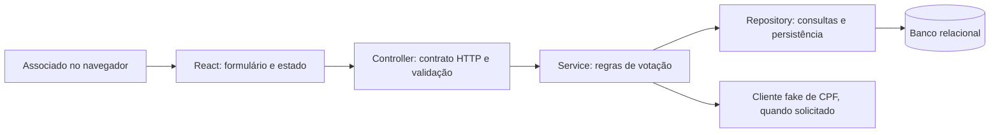

# Arquitetura e decisões

## Caminho de uma operação

Uma API única e um frontend são suficientes para este desafio. Não há microserviços, fila ou serviço separado de encerramento de sessões. Essa escolha mantém execução e análise do código simples.

## Backend e contrato

Java 17 permite usar records nos DTOs e já está disponível no ambiente de desenvolvimento. Spring Boot 3.5.16 oferece uma base conhecida com MVC, JPA, validação, testes e observabilidade. A compatibilidade de Java foi conferida na [documentação oficial](https://docs.spring.io/spring-boot/3.5/system-requirements.html). As dependências seguem o gerenciamento de versões do Spring Boot, com Maven Wrapper para reproduzir a versão da ferramenta de build.

Controllers traduzem HTTP e validam o formato. Services concentram as regras. Repositories expressam a persistência. DTOs mantêm o contrato externo independente das entidades JPA. A API não serializa diretamente relacionamentos de entidades.

Erros previsíveis recebem status e códigos estáveis, mensagens em português e formato ProblemDetail. Erros de entrada não devem revelar stack traces. Logs ajudam a identificar operações e recursos sem registrar o CPF ou a identificação do associado.

## Tempo e sessão

Cada sessão tem abertura e encerramento persistidos. O backend aceita o voto apenas antes do encerramento; no instante exato do prazo, a sessão já encerrou. O estado deriva das datas, portanto reiniciar a aplicação não reinicia a contagem.

`Clock` é injetado para permitir testes determinísticos, sem aguardar um minuto ou depender do relógio da máquina. O frontend exibe uma estimativa do tempo restante usando o relógio do navegador; o status retornado pelo servidor determina se o formulário de votação aparece. Ao zerar a estimativa, a interface consulta o estado novamente e mantém a consulta periódica. Um relógio adiantado não deve impedir votos ainda válidos, e um relógio atrasado não mantém o formulário aberto quando a API informa encerramento. Entre atualizações, o backend continua recusando qualquer voto fora do prazo.

Decisões adotadas para lacunas do enunciado: uma sessão por pauta, sem reabertura; duração em minutos inteiros de 1 a 1440; resultado parcial enquanto a sessão está aberta; empate e ausência de votos são resultados próprios. Essas decisões podem ser ajustadas caso o processo forneça outra regra.

## Voto único e concorrência

Uma restrição única em `(pauta_id, associado_id)` protege o voto único. Duas requisições podem observar simultaneamente a ausência de voto; por isso, consultar antes de inserir não é garantia suficiente. A restrição do banco permanece válida mesmo nessa disputa.

A violação correspondente vira conflito HTTP 409 e a transação inválida é revertida. O banco também impõe uma única sessão por pauta. Não há bloqueio global da pauta para cada voto, o que permite trabalhar com associados diferentes em paralelo.

As contagens são agregadas no banco, sem carregar uma coleção inteira de votos na memória Java. Há índice para pauta/opção de voto e paginação na lista de pautas. São escolhas que limitam o trabalho por requisição; a capacidade de carga precisa ser demonstrada por medição, não deduzida apenas da arquitetura.

## Persistência e ambientes

H2 em arquivo é o modo local para permitir testar com um JDK e Node, sem instalar um servidor de banco. Ele usa persistência em disco, transações e restrições; não é um mock de repository. O [H2 documenta os modos em arquivo e memória](https://h2database.com/html/features.html).

As migrações Flyway criam o esquema; Hibernate valida o esquema em vez de alterá-lo implicitamente. O perfil PostgreSQL e o compose oferecem uma alternativa para execução com um banco separado. As mesmas migrações são usadas nos dois modos. Diferenças entre mecanismos de banco devem ser verificadas no ambiente escolhido antes da implantação.

O modo H2 embutido atende a uma instância da aplicação. Para múltiplas instâncias ou implantação escalável, usar PostgreSQL e validar a configuração real de conexões, recursos e carga.

## Interface

React/TypeScript organiza os fluxos de cadastro, sessão, voto e resultado. Estados de carregamento e erro fazem parte do fluxo. A seleção e a busca precisam descartar respostas antigas para que uma requisição lenta não substitua dados de uma pauta mais recente. Envio em andamento impede clique repetido, enquanto o backend continua responsável pela integridade.

O proxy do Vite mantém chamadas relativas a `/api` no desenvolvimento. Na imagem Docker, o frontend é servido pelo próprio backend, na mesma origem. Isso dispensa liberar CORS indiscriminadamente.

## Hospedagem da demonstração

A implantação usa uma VM Ubuntu 24.04 ARM64 com Docker Compose: Caddy recebe HTTPS, encaminha para Spring Boot e o backend consulta PostgreSQL 17. O React compilado está dentro do JAR, portanto interface e API compartilham domínio. O runtime Java usa Eclipse Temurin 17 sobre Ubuntu Jammy, disponível para AMD64 e ARM64; as duas arquiteturas são verificadas na CI.

Somente o proxy publica portas HTTP/HTTPS. Banco e aplicação comunicam-se pelas redes dos containers, e a administração SSH aceita apenas o IP configurado do administrador. Credenciais são geradas no servidor, fora do Git. Volumes guardam os dados PostgreSQL e os certificados do Caddy; a política de reinício dos containers e o serviço Docker permitem recuperar a aplicação após reiniciar a VM.

Uma VM única simplifica a avaliação, mas não oferece alta disponibilidade. O dump antes de cada atualização protege contra falhas de atualização; como fica no mesmo servidor, não protege contra perda do disco. Para um serviço real, seriam necessários backups externos com restauração testada, monitoramento, identidade verificada e dimensionamento medido. O [guia de hospedagem](../deploy/README.md) registra operação, custos e encerramento dos recursos.

## Bônus

- **Versionamento:** `/api/v1`. Mudanças incompatíveis devem entrar em outra versão, mantendo clientes existentes durante a migração. Mudanças aditivas compatíveis não exigem trocar a versão automaticamente.
- **CPF fake:** o cliente é substituível. Recebe um CPF de teste e retorna aleatoriamente apto, inapto ou inválido. Nos testes, as respostas são controladas. O usuário opta por executar a simulação ao informar CPF no voto; sem esse campo, o fluxo principal usa o ID do associado. CPF inapto e inválido retornam 404, seguindo a interpretação documentada do exemplo do enunciado.
- **Desempenho:** script reproduzível com associados sintéticos, contagem final e métricas de latência/vazão/erros. Usar exclusivamente um ambiente de teste e consultar as limitações do relatório de validação.

## Como explicar na entrevista

1. Apresentar o fluxo pauta → sessão → voto → resultado.
2. Mostrar uma requisição passando por controller, service e repository.
3. Explicar por que a restrição única no banco complementa as validações Java.
4. Demonstrar como o `Clock` permite testar o instante de encerramento.
5. Diferenciar teste unitário, integração com banco real e teste de navegador.
6. Mostrar o teste de reinício e explicar onde os dados ficam.
7. Apresentar o que foi medido, as limitações e o que mudaria antes de produção.

O uso de IA como auxílio foi autorizado pela recrutadora. A solução deve ser revisada, testada e compreendida pelo candidato; este documento apoia essa revisão, sem substituir a prática de explicar e alterar o código.
